CUDA Denoiser For CUDA Path Tracer
================

**University of Pennsylvania, CIS 565: GPU Programming and Architecture, Project 2**

* RHUTA JOSHI
  * [LinkedIn](https://www.linkedin.com/in/rcj9719/)
  * [Website](https://sites.google.com/view/rhuta-joshi)

* Tested on: Windows 10 - 21H2, i7-12700 CPU @ 2.10 GHz, NVIDIA T1000 4096 MB
* GPU Compatibility: 7.5


## Introduction - Path Tracer

Ray-tracing is a computer graphics technique to generate 3-dimensional scenes in which we calculate the exact path of reflection or refraction of each ray and trace them all the way back to one or more light sources. Path tracing is a specific form of ray tracing that simulates the way light scatters off surfaces and through media, by generating multiple rays for each pixel(sampling) and bouncing off those rays based on material properties.
Since we cast many rays per pixel in order to get enough light information, we can get effects like caustics, soft shadows, anti-aliasing, and depth of field. Since this technique involves computing a large number of rays independently, it can be highly parallelized to converge images incredibly faster on a GPU as compared to a path tracer implementation on CPU. In this project, I have used CUDA to compute intersections and shading per iteration for multiple rays parallelly.


## Introduction - Denoiser


In this branch, I have explained how I enhanced my path tracer by implementinf a pathtracing denoiser that uses geometry buffers (G-buffers) to guide a smoothing filter.


## Technical Background

This implemetation is based on the paper ["Edge-Avoiding A-Trous Wavelet Transform for fast Global Illumination Filtering,"](https://jo.dreggn.org/home/2010_atrous.pdf) by Dammertz, Sewtz, Hanika, and Lensch.

Denoisers can help produce a smoother appearance in a pathtraced image with fewer samples-per-pixel/iterations, although the actual improvement often varies from scene-to-scene. Smoothing an image can be accomplished by blurring pixels - a simple pixel-by-pixel blur filter may sample the color from a pixel's neighbors in the image, weight them by distance, and write the result back into the pixel.

### A-Trous filter
A simple Gaussian blur may look something like this:
```
for each pixel being blurred:
	sample every pixel in blur radius
	multiply by a weight in a weight distribution called a "filter," or h
	sum results and write result into result buffer
```
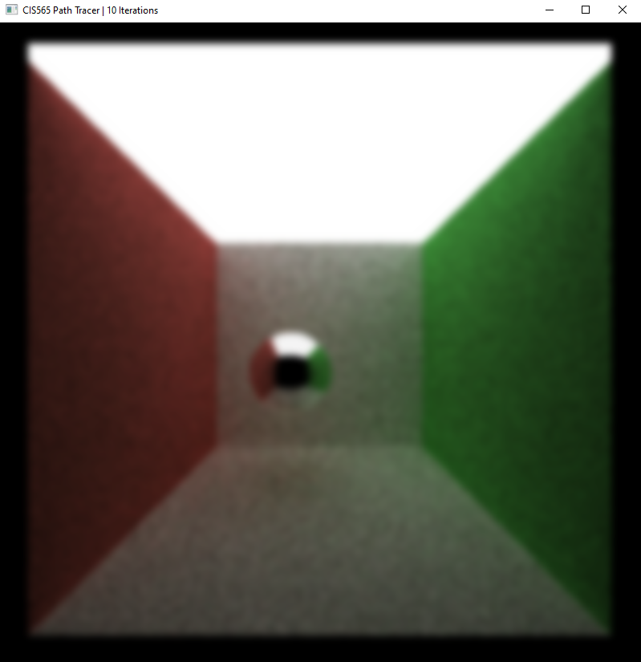

However, this can be computationally expensive. For a 16x16 blur width/filter, this is 256 pixel reads for each pixel blurred. So instead, we use ATrous filter. Atrous filter reduces the number of pixels to be taken into consideration for blur, by iteratively spreading a small mask/filter spatially or in other words, by applying sparse blurs of increasing size.

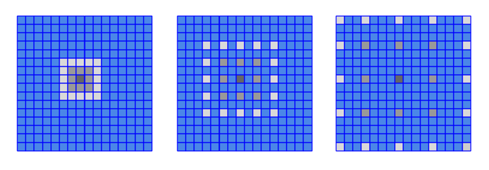

### G-buffers

Simply applying the filter blurs the entire image without taking features like edges, positions, depth and normals into consideration.

|ATrous simple blur| Atrous filter with edge avoidance|
|---|---|
||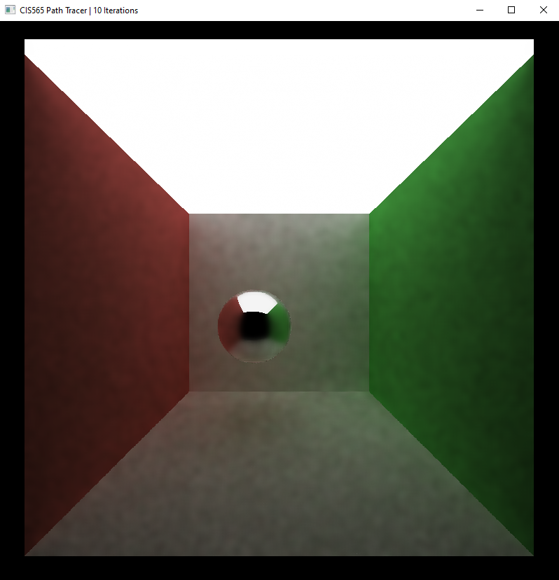|

To detect and avoid edges while applying the filter, we make use of deferred shading, in which we first store the geometry information such as position, normals and depth in a buffer and based on weights assigned to each buffer, tune our denoiser for better results.

|Position G-buffer|Normal G-buffer|Depth G-buffer|
|---|---|---|
|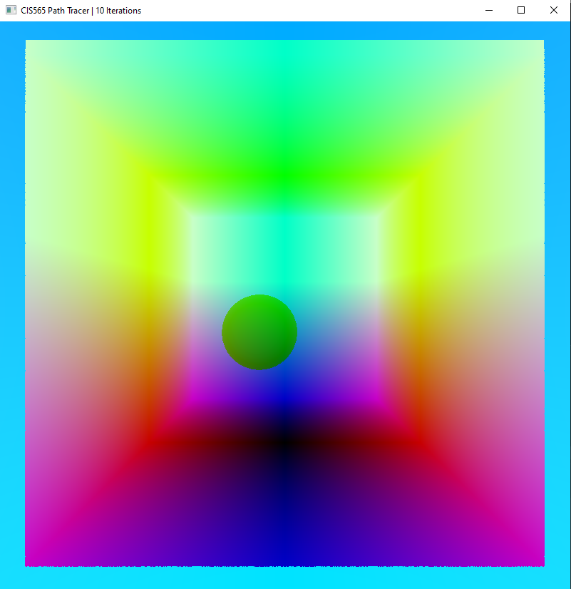|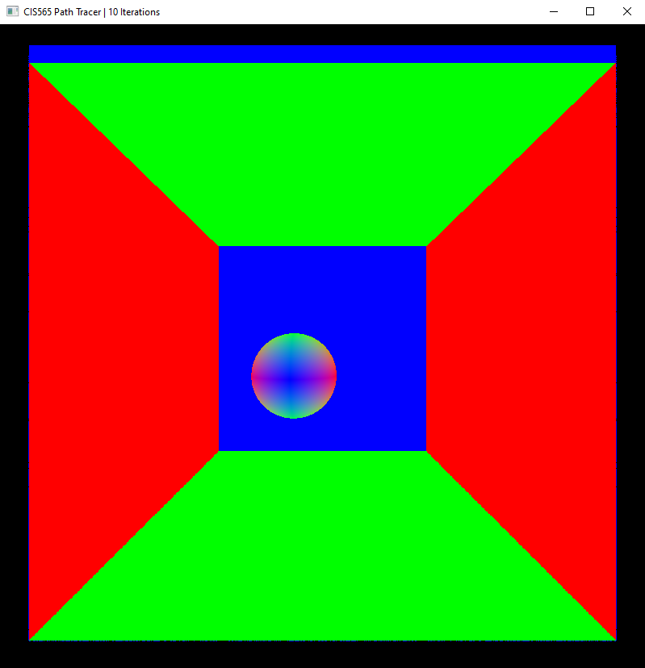|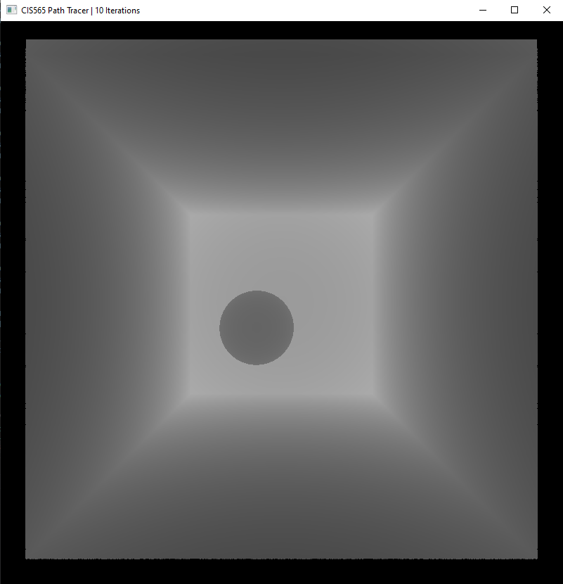|


## Denoising Results

This denoiser however, does not always give best visual approximation especially for specular transmissive materials as you can see below

|Diffused|Reflective|Transmissive|
|---|---|---|
|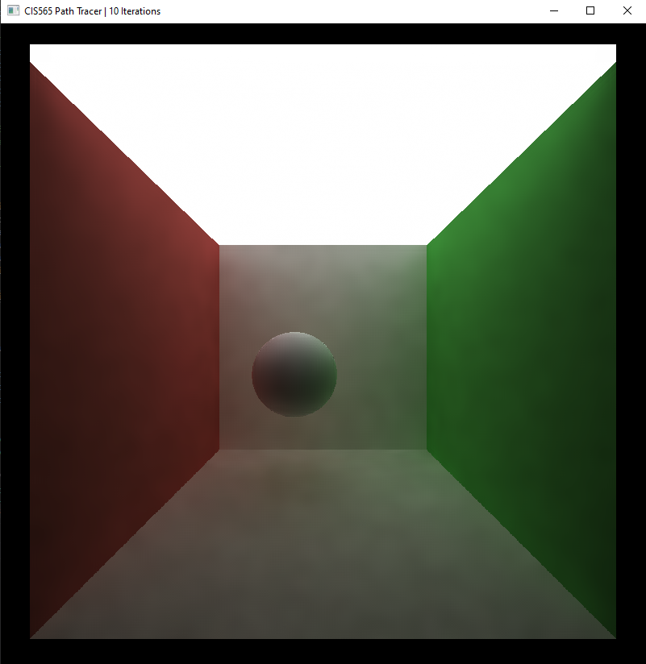|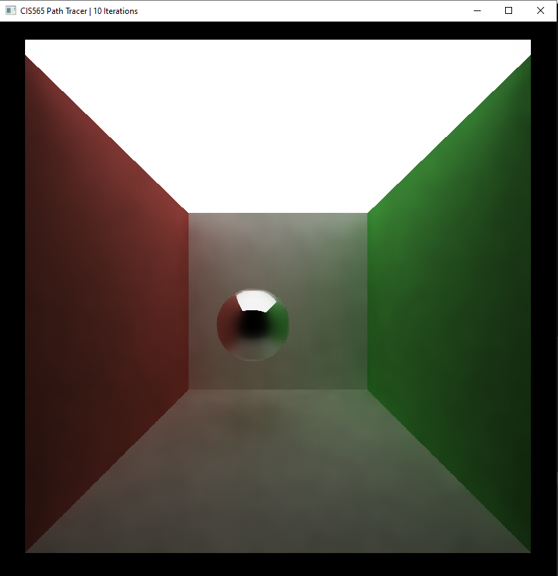|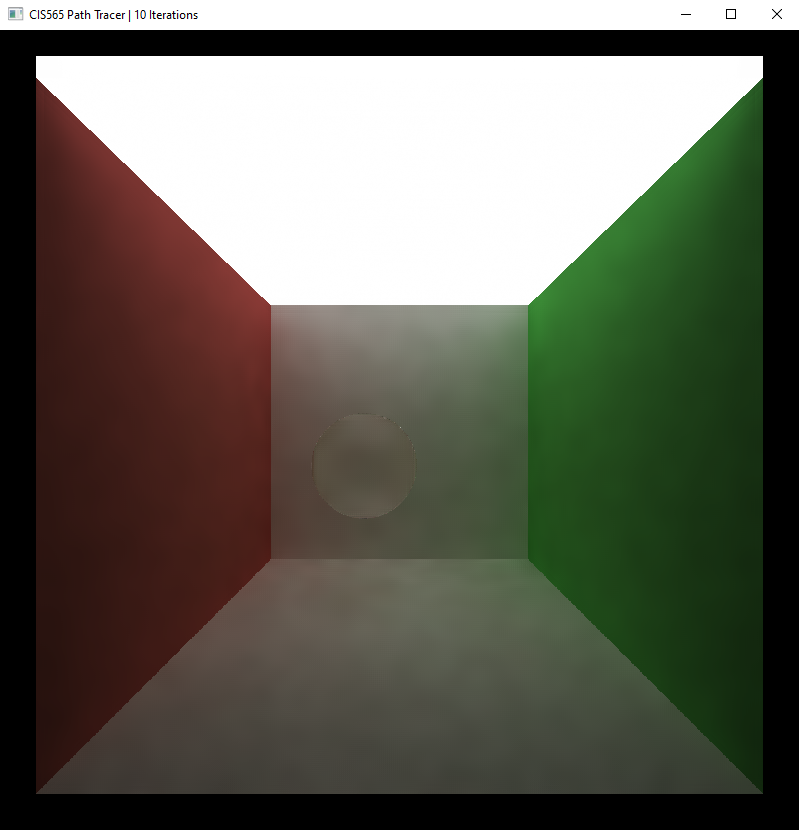|

While the denoiser may add a small overhead, it generates equally acceptable images in very less iterations, thus making it an effective feature for a path tracer. As the size of kernel increases time taken to denoise the image also increases. And not surprisingly, as the resolution of our render increases, time taken to denoise it also increases because of increased number of pixels to be denoised.
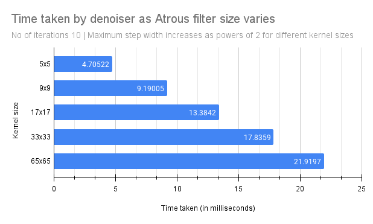
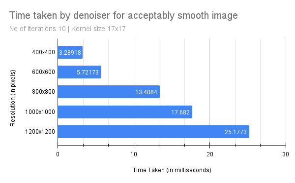

## Bloopers
